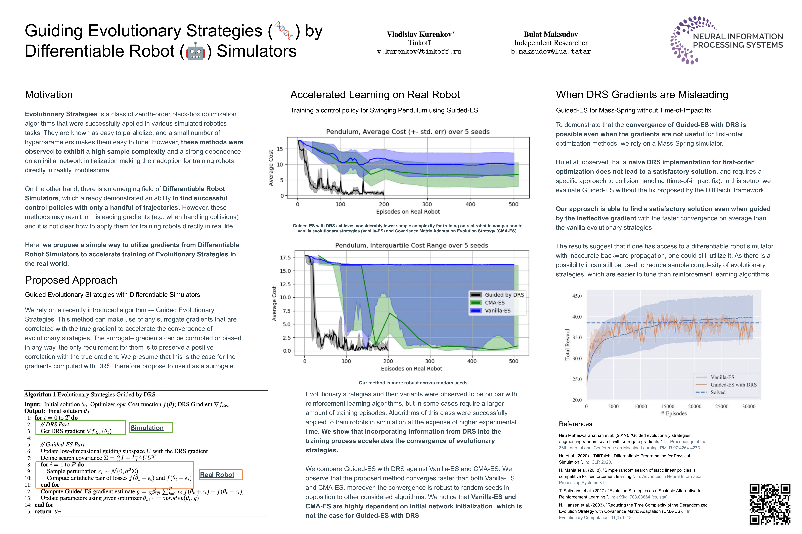

# Guiding Evolutionary Strategies by Differentiable Robot Simulators

In recent years, Evolutionary Strategies were actively explored in robotic tasks for policy search as they provide a simpler alternative to reinforcement learning algorithms. However, this class of algorithms is often claimed to be extremely sample-inefficient. On the other hand, there is a growing interest in Differentiable Robot Simulators (DRS) as they potentially can find successful policies with only a handful of trajectories. But the resulting gradient is not always useful for the first-order optimization. In this work, we demonstrate how DRS gradient can be used in conjunction with Evolutionary Strategies. Preliminary results suggest that this combination can reduce sample complexity of Evolutionary Strategies by 3x-5x times in both simulation and the real world.

To appear in [4th Robot Learning Workshop: Self-Supervised and Lifelong Learning](http://www.robot-learning.ml/2021/)

[Paper](https://arxiv.org/abs/2110.00438) -- Video -- Poster





## Citation
Please use the following Bibtex entry: 
```
@misc{kurenkov2021guiding,
      title={Guiding Evolutionary Strategies by Differentiable Robot Simulators}, 
      author={Vladislav Kurenkov and Bulat Maksudov},
      year={2021},
      eprint={2110.00438},
      archivePrefix={arXiv},
      primaryClass={cs.RO}
}
```
